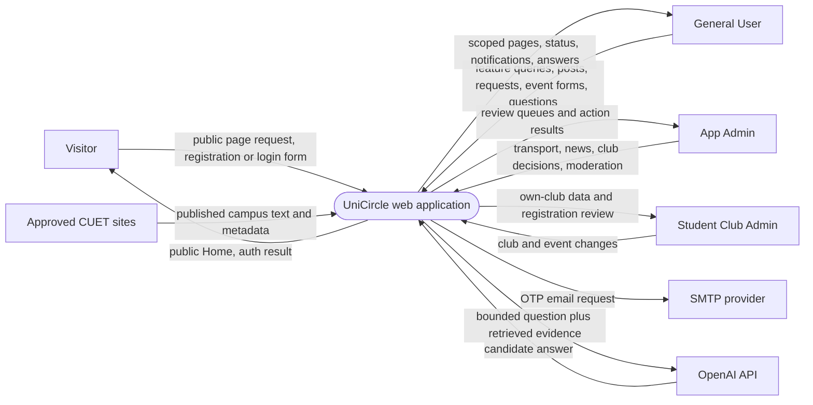
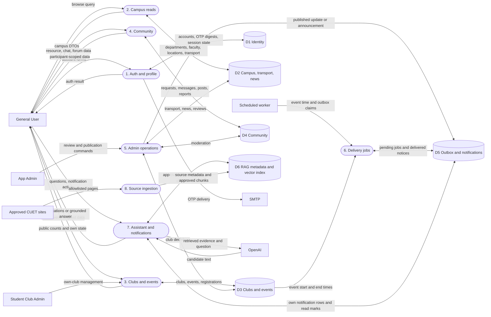
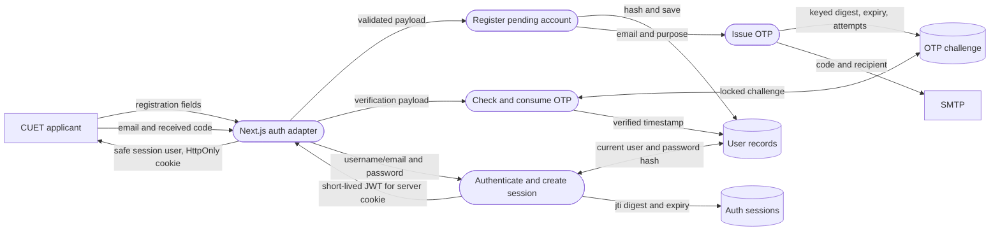

# UniCircle data flow diagrams (DFD)

Status: **logical design**, based on the [HLD](HLD.md), [LLD](LLD.md), and [ERD](ERD.md). Rounded nodes are processing functions, cylinders are persistent stores, and rectangles are external people/systems. Arrows label data, not authorization grants. The browser-to-Next.js BFF hop is inside the UniCircle boundary; FastAPI is the final data-authorization boundary.

## Level 0 — context

No user password, OTP, JWT, private chat, registration record, or bKash transaction ID is sent to OpenAI. The SMTP provider receives only the verification recipient, code, and basic email content. The frontend never sends a user-supplied role, owner ID, or club-admin flag as authority.

## Level 1 — primary processes and data stores

`D1`–`D5` are logical areas of the same PostgreSQL database, not separate deployed databases. `D6` combines PostgreSQL source metadata with a vector index whose product is still unselected. The delivery worker is a planned process; current backend code has only a notification service foundation. Access to every store is mediated by services/repositories rather than direct browser queries.

## Level 2 — account registration and verification

The application does not send an access token after registration or OTP issuance. Password plaintext exists only in the inbound request long enough to verify/hash it. The OTP challenge stores a digest; the code is delivered by email only. OTP verification and `verified_at` update must be atomic. Login reads current account state and writes an active session. See the [authentication sequence](Sequence_Diagram.md#registration-verification-and-login) for ordering, retries, and failure branches.

## DFD balancing and privacy checks

- Level 1 inputs/outputs are subsets of Level 0: visitors/users/Admins provide forms and commands; UniCircle returns scoped views/results; SMTP, CUET sites, and OpenAI are the only external data collaborators shown.
- The document [flow diagram](Document_Flow_Diagram.md) tracks individual forms and review records; it should not be read as a second database design.
- The notification list is owner-scoped, conversation data is participant-scoped, and event-registration rows are limited to the registrant and that club's admins. Data minimization belongs in response DTOs, not just frontend hiding.
- App Admin operations pass through FastAPI authorization even if an Admin-only page is hidden from General Users. No direct `D1`–`D6` browser access exists.
