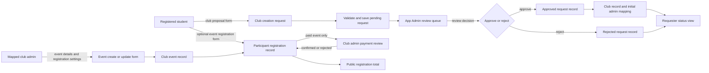
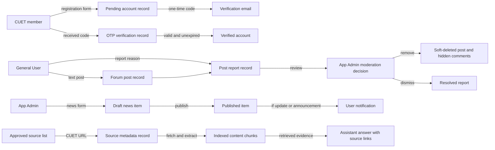
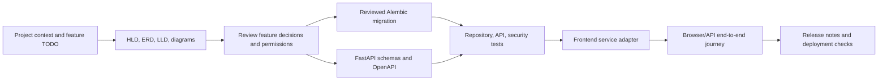

# UniCircle document flow diagram

Status: **planned business-document and development-artifact flows**. Here, a *document* means a submitted form, review record, notification, or source record—not necessarily a PDF or uploaded file. This differs from the [data-flow diagrams](Data_Flow_Diagram.md), which focus on processes and data stores. No workflow below implies that these records or endpoints already exist.

## Student and Admin business documents

The club proposal document includes proposed name/short name, category, description, activities, purpose, campus need, and expected impact. Only a student may submit it. The App Admin's decision record includes reviewer and timestamp. Approval is a single database transaction: one public club plus the requester's initial club-admin mapping. Rejection leaves no public club. A student may later administer multiple clubs, and a club may have multiple student admins.

The event form records its club, dates, location, and registration mode (`none`, `free`, `paid`). The participant form exists only when registration is enabled and captures name, CUET email, student ID, department, and a bKash transaction ID for paid events. Fee/bKash number is displayed from the event configuration. A submitted transaction ID is a claim awaiting review, not confirmed payment. Individual registration forms are visible only to that club's admins and authorized backend staff; general users see the count and their own submission.

## Account, moderation, announcements, and source documents

Codes, passwords, and JWTs are **not** business documents and must not enter reports or logs. Store only password hashes, OTP digests, and session-token identifiers as designed in the [ERD](ERD.md). News publication and notification work are linked through a durable outbox so a failed worker can retry without duplicate notices. Source chunks must carry provenance, and only approved CUET URLs enter the assistant knowledge base.

## Document access and lifecycle

| Document/record | Creator → reviewer/consumer | Visibility | Finalization rule |
| --- | --- | --- | --- |
| Registration form / pending account | CUET member → auth service | Account owner and auth service | CUET email OTP verifies before login |
| Club creation request | Student → App Admin | Requester, App Admin | One approval or rejection; reviewed timestamp |
| Club admin assignment | Club Admin or approval transaction → mapped student | That club's admins; own permission state | Never remove the final admin |
| Event registration | Student → that club's admins | Registrant, authorized club admins | One per user/event; payment reviewed separately |
| Resource request / chat | Requester → recipient; two participants | Participants only | Chat opens only after acceptance |
| Forum report | General User → App Admin | Reporter status if exposed, App Admin detail | Resolve or remove post without losing audit reference |
| News draft / publication | App Admin → General Users | Draft: Admin only; published: General Users | Publish timestamp and notification job commit together |
| Transport schedule | App Admin → General Users | Admin may edit; users see current/future dates | Recurrence materializes bounded dated rows |
| RAG source record | Approved source curator → ingestion/query | Source metadata may accompany answers | Fetch only allowlisted URLs and track content version |

Retention periods, deletion requests, and archival rules for personal data need an explicit policy before production. Until then, do not delete audit-linked rows casually or retain OTPs longer than their short operational lifetime.

## Development document-control flow

A feature's mock UI is not evidence that its backend document flow works. Each migration and API contract must be checked against the design, and the design must be updated if implementation reveals a deliberate change. See the [LLD](LLD.md) for the planned route and transaction contracts.
