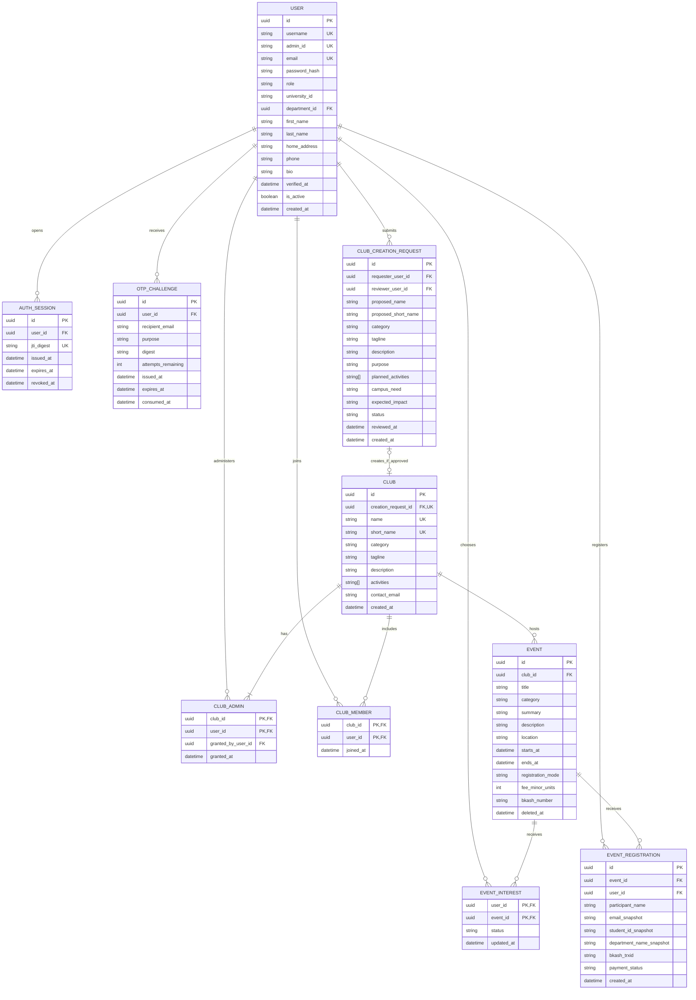
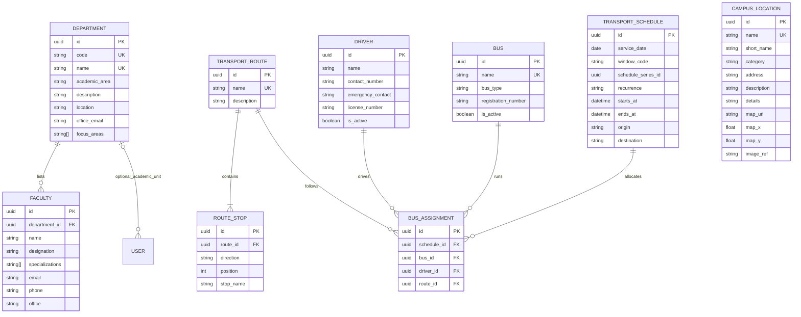
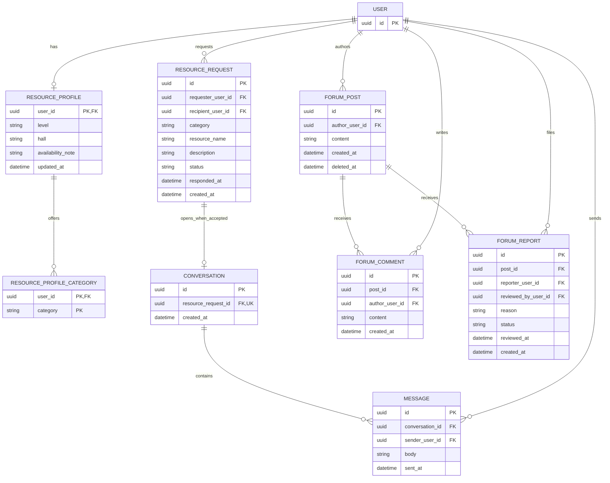
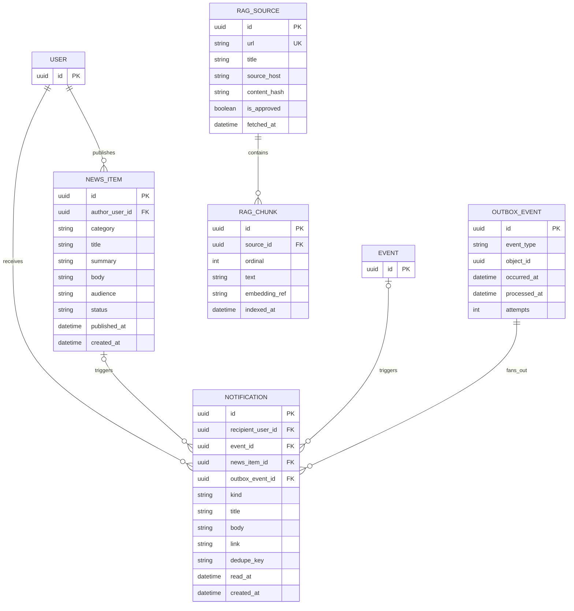

# UniCircle entity–relationship design

Status: project ERD, drafted 2026-09-20 from the [project context](../../UniCircle_AI_Project_Context.md) and [feature plan](../../UniCircle_Feature_Wise_Implementation_TODO.md). The project owner authorized creating the missing ERD. These are **logical tables and intended constraints**, not a claim that migrations already exist. Implement each area through reviewed Alembic migrations during Phase 7. See the [design index](README.md), [HLD](HLD.md), and [LLD](LLD.md) for runtime and API boundaries.

`USER` is shared across the diagrams. `PK`, `FK`, and `UK` mark primary, foreign, and unique keys. Nullable fields and multi-column constraints are specified below the diagrams; Mermaid does not express every PostgreSQL rule. IDs are UUIDs unless noted. All timestamps are timezone-aware UTC. Money is integer minor units (paisa), not floating point.

## Identity, clubs, and events

- `USER.role` is `student`, `teacher`, `staff`, or `admin`. Public registration accepts only the first three. General users require `username`, a canonical `@cuet.ac.bd` email, names, home address, and `university_id`; Admin accounts instead require `admin_id` and are created only by a restricted provisioning command. `password_hash` is Argon2; no plaintext password column exists. `verified_at` is null until CUET email verification. Admin accounts are provisioned as verified. `is_active` gates all protected access. The existing `AuthIdentity.is_verified` is derived from `verified_at IS NOT NULL`.
- Uniqueness: case-insensitive `username`, canonical `email`, `admin_id`, and `(role, university_id)` for general users. Add `CHECK` constraints for role-dependent nullability and valid roles. Do not treat a client role or JWT role claim as authority.
- `OTP_CHALLENGE` has a unique `(recipient_email, purpose)` key for the current challenge. Store only a keyed digest, not the code. Issuance, cooldown, attempt decrement, expiry, consumption, and replacement must use a transaction/row lock. `AUTH_SESSION` stores a digest of the JWT `jti`, never the JWT itself; logout revokes the row. Every authenticated request verifies the JWT, the unrevoked session, and the current user record.
- `CLUB_ADMIN` is a student-only many-to-many mapping, independent of global App Admin. A club must retain at least one admin; enforce this in a locked transaction when removing admins. Club-request approval locks the pending request, creates exactly one club and its initial admin, and records the reviewer atomically. Existing CUET clubs may have null `creation_request_id` and must be seeded with at least one admin before club management opens.
- Club short name, category, tagline, and activities are needed by the current frontend. A request must also capture purpose and the planned campus need/impact required by the workflow; the existing mock form will need those additional fields when connected.
- `CLUB_MEMBER` is optional general membership information, not a grant of management privileges. Do not infer club-admin status from it.
- `EVENT.registration_mode` is `none`, `free`, or `paid`; paid events require positive `fee_minor_units` and `bkash_number`. Event state (`upcoming`, `ongoing`, `finished`) is derived from the current time and start/end timestamps. `EVENT_INTEREST.status` is `interested` or `going`, one row per `(user_id, event_id)`.
- Public `CLUB.memberCount` is derived from `CLUB_MEMBER`; `EVENT.attendeeCount` counts `going` interest rows and `EVENT.registeredCount` counts submitted registrations. A paid registration still counts as submitted while payment review is pending; the UI must not label that as confirmed payment.
- `EVENT_REGISTRATION` is student-only and unique on `(event_id, user_id)`. The form captures participant details as snapshots; validate the CUET email and compare student identity to the authenticated account. For paid events, require `bkash_trxid` but set `payment_status=pending_review` until a club admin verifies it. A submitted transaction ID is **not** proof of payment. Expose only the registration total publicly; restrict individual rows to that club's admins and authorized staff. Consider a partial unique index on `(event_id, bkash_trxid)` where the transaction ID is present.

## Directory, campus, and transport

- Seed the 11 required departments. A general user's `department_id` is optional; staff or newly registered users need not claim an academic department. Faculty contact data is directory content, not automatically a login account; linking a faculty profile to a registered teacher is optional future work. Missing faculty contact fields remain null rather than fabricated.
- Home-page content stays static unless Admin-managed content is explicitly requested. Campus images/video are asset references, not database blobs.
- One `TRANSPORT_SCHEDULE` represents a date and one of the four daily time windows. Unique `(service_date, window_code)`. Admin `once`/`weekly`/`monthly` input materializes dated rows over a bounded date range; generated rows share `schedule_series_id` for later batch updates, while `recurrence` records the source rule. `BUS_ASSIGNMENT` connects the specific buses, drivers, and route variant for that window; unique `(schedule_id, bus_id)` and prevent overlapping allocation of a bus/driver. A driver's assignment belongs to a schedule, not permanently to a bus. `ROUTE_STOP` has unique `(route_id, direction, position)`. Routes include regular and Chawkbazar variants, with outbound/return ordered stops. General-user queries exclude past service dates.

## Resource requests, chat, and community

- `RESOURCE_PROFILE` supplies optional discovery details and categories; private contact/address fields from `USER` are not returned in discovery. The mock `mutualConnections` number has no supported data source and must be removed from the live DTO rather than invented. `RESOURCE_REQUEST.status` is `pending`, `accepted`, or `rejected`, and requester/recipient must differ. `CONVERSATION.resource_request_id` is unique and can be created only for an accepted request. Only the two request participants may read or send messages. Chat is **not** claimed to be cryptographically end-to-end encrypted.
- Forum posts and comments contain text only. No reactions or media tables. Reports are unique per `(post_id, reporter_user_id)`; only App Admin may review them. Use soft deletion for moderated posts so reports and audit relationships remain intact; hide deleted posts and their comments from normal feeds.

## News, notifications, and AI knowledge

- Only App Admin can create or manage news. `NEWS_ITEM.status` is `draft` or `published`; only published items appear to general users. `NOTIFICATION` is owner-scoped and unique on `(recipient_user_id, dedupe_key)`; this prevents duplicate event-start/end and announcement notices. `event_id` and `news_item_id` are optional related-object references, with at most one present. Do not expose another user's notifications. Publishing an **update or announcement** inserts `OUTBOX_EVENT` in the same transaction; a worker fans out notifications with retries and idempotent keys. Ordinary news need not notify everyone. Event start/finish detection must be scheduled separately and enqueue each transition only once.
- `RAG_SOURCE` is restricted to approved CUET URLs. `RAG_CHUNK` has unique `(source_id, ordinal)` and source metadata for citations. `embedding_ref` can point to the selected vector index; this ERD does **not** preselect a vector database or embedding model. No chat-transcript storage is required by the current AI-assistant workflow.

## Authentication and migration decisions

1. Backend issues short-lived HS256 access JWTs with `sub`, `iss`, `aud`, `iat`, `nbf`, `exp`, and random `jti`. The existing default is 30 minutes. `JWT_SECRET` is a server signing **key**, not a pre-made token; users must never paste a JWT into that variable. Use a distinct `OTP_PEPPER`. Both must be long random values supplied outside Git. JWTs contain no trusted role claim. [FastAPI's JWT guidance](https://fastapi.tiangolo.com/tutorial/security/oauth2-jwt/) notes that JWT payloads are signed, not encrypted.
2. Use a same-origin Next.js backend-for-frontend (BFF) for browser requests: the BFF sets an `HttpOnly`, `Secure` (production), `SameSite=Lax`, host-only cookie containing the access JWT; it sends the JWT to FastAPI as a Bearer token server-side. Do not put tokens in `localStorage` or `sessionStorage`. Check `Origin` and a CSRF token on state-changing cookie-authenticated requests; SameSite alone is not a CSRF solution. Browser JavaScript never reads the JWT. [OWASP's session guidance](https://cheatsheetseries.owasp.org/cheatsheets/Session_Management_Cheat_Sheet.html) supports these cookie and CSRF precautions.
3. Version 1 has no refresh token. On expiry, require login again. Login creates `AUTH_SESSION` with a digest of `jti`; protected requests require an unrevoked, unexpired session and the current active/verified user. Logout revokes that session and clears the cookie. Admin deactivation revokes all of that user's sessions. Session lookups add a database read; index `user_id`, `jti_digest`, and expiry. A future refresh-token design requires a separate review and migration.
4. A restricted one-time Admin provisioning command will accept Admin ID/password from a secure interactive prompt or temporary environment variables, hash the password, insert `USER.role=admin`, and remove the bootstrap secret from the environment afterward. Public registration can never set `admin`. Club-admin rights come only from `CLUB_ADMIN` membership. No default Admin credentials are seeded.
5. Review migrations in dependency order: `USER`/auth, directory/campus, clubs/events, transport, resources/chat, forum, news/notifications, then RAG metadata. Add constraints and indexes in the same migration as each table, with reversible downgrades where safe. Seed only non-secret development reference data. Never seed production passwords or OTPs.

These choices make Phase 7 implementation possible; API response shapes, rate limits, deployment origins, and the vector engine should still be verified as their corresponding features are built.
