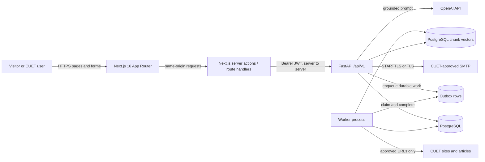
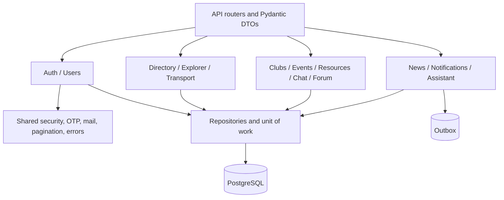

# UniCircle high-level design (HLD)

Status: **working design for Phase 7**, not an implementation report. This document follows the [project context](../../UniCircle_AI_Project_Context.md), [feature plan](../../UniCircle_Feature_Wise_Implementation_TODO.md), and [ERD](ERD.md). Details for endpoints and transactions are in the [LLD](LLD.md).

## Scope and system boundary

UniCircle is a CUET web application. Public visitors see Home and may register or log in; all other feature pages require authentication. Students, teachers, and staff are General Users. A student may separately administer one or more clubs through a per-club mapping. The App Admin is provisioned privately and controls central transport, news, club-request review, and forum moderation. Home media is a frontend asset; attendance and arbitrary Admin CRUD are outside the current scope.

The browser talks to Next.js, not directly to FastAPI for authenticated operations. Next.js sets an HttpOnly cookie, reads it only on the server, and forwards the short-lived JWT to FastAPI. FastAPI checks the JWT, session row, current account state, and resource-specific permissions. Next.js route/layout guards improve navigation but are not the authorization boundary. This follows the installed Next.js authentication guide's distinction between optimistic UI checks and secure checks near the data source; see also [Next.js authentication guidance](https://nextjs.org/docs/app/guides/authentication) and [OWASP REST access-control guidance](https://cheatsheetseries.owasp.org/cheatsheets/REST_Security_Cheat_Sheet.html).

The existing `NEXT_PUBLIC_API_URL` frontend variable is an unused placeholder from the mock phase. Do not use it to send authenticated browser requests or expose Bearer tokens; server-side BFF calls use backend-only configuration.

## Major components

| Component | Responsibility | Owns or accesses |
| --- | --- | --- |
| Next.js pages and feature components | Responsive screens, client interaction, loading/error/empty states | Public assets and safe response DTOs only |
| Next.js BFF | Login cookie, CSRF/origin checks, server-side API adapter, protected layout/session bootstrap | Short-lived JWT in HttpOnly cookie; no database credentials |
| FastAPI feature routers | Validate requests and expose versioned JSON contracts | `/api/v1`, never unrestricted ORM entities |
| FastAPI services/repositories | Business transitions, object-level authorization, transactions | PostgreSQL through SQLAlchemy sessions |
| PostgreSQL | Accounts, OTP/session state, campus/community content, outbox, RAG source metadata | Migrations via Alembic |
| Notification worker | Idempotent event/news fanout and scheduled event-state detection | Outbox and notifications |
| RAG ingest/query modules | Approved-source ingestion and grounded, cited answers | Source metadata, vector index, OpenAI API |
| SMTP | Deliver verification codes | Recipient and one-time code; no other account data |

The durable notification worker remains a planned runtime component. RAG refresh is an explicit CLI/scheduled operation, not an API-request task. PostgreSQL is the approved relational store and holds the bounded first-version chunk vectors as JSON; `text-embedding-3-small` is the selected embedding model. A dedicated vector extension/service is deferred until corpus size requires it. SMTP provider and production host remain deployment decisions.

## Internal backend boundaries

Feature modules own their schemas, routes, services, repositories, and tests. Shared code contains only genuinely cross-feature utilities. The API layer returns the existing success/error envelope, not ORM instances. A request-scoped session does not auto-commit; the service owns commit/rollback and emits outbox rows in the same transaction as state changes.

## Trust and privacy boundaries

1. Browser input, campus-source HTML, and AI output are untrusted. Validate before use or display. Do not send passwords, OTPs, JWTs, private chat, or registration/payment records to OpenAI.
2. General User, Club Admin, and App Admin are different permission scopes. Club Admin is a student-to-club relationship, not a global JWT role. Every mutation checks current database state.
3. Public club/event and news DTOs omit individual event registrations, bKash transaction IDs, home addresses, and private contact information. The public event count is derived from registration rows.
4. Account and notification queries are owner-scoped. Conversation participants and resource-request participants are verified on every access.
5. Secrets live in ignored local `.env` or a production secret manager, never in browser-visible `NEXT_PUBLIC_*` values or repository source. `.env` placeholders are intentionally nonfunctional.

## Deployment shape and operations

The target topology is one public HTTPS origin for Next.js, a non-public or tightly restricted FastAPI origin reachable by the BFF, PostgreSQL, a separate worker process, and outbound TLS access to SMTP, approved CUET sources, the vector service, and OpenAI. Development may use `localhost:3000` and `localhost:8000`; production DNS, host, and network policy remain deployment decisions. If FastAPI is exposed for non-browser clients, it must independently enforce authentication, rate limits, CORS, and per-object authorization.

Apply reviewed Alembic migrations before starting a new API revision. Keep liveness (`/health`) separate from dependency readiness. Use structured logs without request bodies or secrets; include request IDs and safe error codes. Back up PostgreSQL and document restore tests before deployment. Background jobs require idempotency, retries, and failure visibility. Static Home media stays with the frontend unless a later content-management requirement changes that decision.

## Planned release order

Auth and profile → directory/campus content → clubs/events → resources/chat → transport → forum → news/notifications → RAG. Each feature cycle adds its migration, API tests, frontend adapter, and end-to-end verification before replacing its mock. Refer to the [feature plan](../../UniCircle_Feature_Wise_Implementation_TODO.md) for the authoritative checklist.
