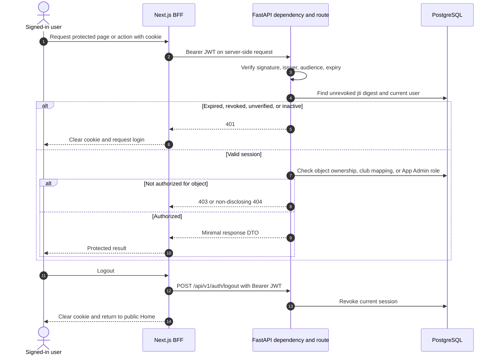
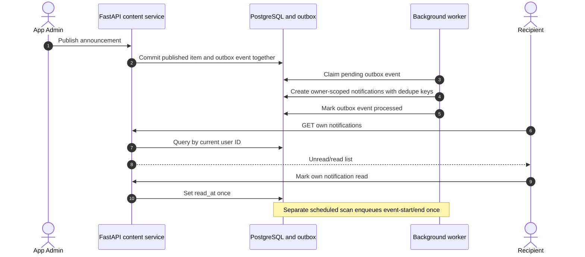

# UniCircle sequence diagrams

Status: **planned Phase 7 behavior**, not implemented APIs. Participants show transaction ordering. For readability, diagrams after authentication omit the Next.js BFF hop; all browser calls still pass through it. Every BFF mutation checks origin/CSRF; every protected FastAPI action verifies JWT, active session, live user, and object-level permission as described in the [LLD](LLD.md).

## Registration, verification, and login

```mermaid
sequenceDiagram
    autonumber
    actor Applicant as CUET applicant
    participant Web as Next.js browser UI
    participant BFF as Next.js auth handler
    participant API as FastAPI auth service
    participant DB as PostgreSQL
    participant SMTP as SMTP provider
    Applicant->>Web: Submit General User registration
    Web->>BFF: POST registration form
    BFF->>API: POST /api/v1/auth/register
    API->>API: Validate CUET email, role, ID, password
    API->>DB: Insert pending account with Argon2 hash
    DB-->>API: Account committed, unique constraints passed
    API->>DB: Atomically save digest, expiry, cooldown, attempts
    API->>SMTP: Send one-time code over TLS
    alt SMTP delivery fails
        API->>DB: Discard just-issued challenge
        API-->>BFF: Safe delivery error; pending account remains
    else Accepted for delivery
        API-->>BFF: Email and next verification step
        BFF-->>Web: Navigate to OTP page
    end
    Applicant->>Web: Enter received six-digit code
    Web->>BFF: POST email and code
    BFF->>API: POST /api/v1/auth/verify-otp
    API->>DB: Lock challenge and account; check digest, expiry, attempts
    alt Invalid, expired, or exhausted
        API->>DB: Update attempt state if applicable
        API-->>BFF: Safe verification failure
    else Valid unused code
        API->>DB: Consume code and set verified_at atomically
        API-->>BFF: Verification complete
        BFF-->>Web: Offer login
    end
    Applicant->>Web: Submit username or CUET email and password
    Web->>BFF: POST login credentials
    BFF->>API: POST /api/v1/auth/login
    API->>DB: Load user; compare hash; require active and verified
    alt Credentials or account state invalid
        API-->>BFF: Generic 401; no account enumeration
    else Valid login
        API->>DB: Create revocable session with jti digest
        API-->>BFF: Short-lived JWT and safe user DTO
        BFF-->>Web: HttpOnly cookie plus safe user DTO
        Web-->>Applicant: Home with authenticated navigation
    end
```

Resend follows the registration challenge-issuance path but first enforces cooldown and rate limits; it gives a generic public response where account existence could otherwise be inferred. The API never returns an OTP. SMTP acceptance does not guarantee inbox delivery, so the UI must allow a safe resend after cooldown.

## Protected request and logout



The cookie is not JavaScript-readable. The BFF never treats its own UI guard as a replacement for FastAPI authorization. No refresh token exists in version 1; a timed-out session requires a new login.

## Club request approval and optional event registration

```mermaid
sequenceDiagram
    autonumber
    actor Student
    actor Admin as App Admin
    actor ClubAdmin as Mapped club admin
    participant API as FastAPI club/event services
    participant DB as PostgreSQL
    Student->>API: Submit proposed club and purpose
    API->>DB: Save pending club request, requester from session
    API-->>Student: Pending request status
    Admin->>API: Review and approve request
    API->>DB: Lock pending request
    alt Already reviewed
        API-->>Admin: Existing decision or conflict; no duplicate club
    else Pending and valid student
        API->>DB: Insert club; insert initial Club Admin; mark approved; commit
        API-->>Admin: One approved club
    end
    Student->>API: Refresh request status and clubs
    API-->>Student: Approved status and club in directory
    ClubAdmin->>API: Create event; choose none, free, or paid registration
    API->>DB: Check club mapping; validate dates and payment configuration
    API->>DB: Save event
    Student->>API: Register for enabled event
    API->>DB: Lock/check event window; verify student; insert unique registration
    alt Paid event
        API->>DB: Save bKash transaction ID as pending_review
        ClubAdmin->>API: Review claimed payment
        API->>DB: Confirm or reject payment after human verification
    else Free event
        API->>DB: Save without transaction ID
    end
    API-->>Student: Own registration state
    ClubAdmin->>API: List own event registrations
    API-->>ClubAdmin: Private registration list
    Student->>API: Refresh event details
    API-->>Student: Public registration total only
```

Club approval, final-admin preservation, and registration uniqueness are database transactions with constraints; UI state is not sufficient. An event interest/Going row is separate from an event registration.

## Resource request and participant-only chat

```mermaid
sequenceDiagram
    autonumber
    actor Requester
    actor Recipient
    participant API as FastAPI resource/chat service
    participant DB as PostgreSQL
    Requester->>API: Send resource request to another user
    API->>DB: Reject self-request; insert pending request
    Recipient->>API: Accept own received request
    API->>DB: Lock pending request; set accepted; create one conversation
    DB-->>API: Conversation ID
    Requester->>API: Refresh own requests
    API-->>Requester: Accepted request and conversation available
    Requester->>API: Post message in conversation
    API->>DB: Verify requester/recipient membership; save text
    Recipient->>API: Refresh or poll conversation messages
    API-->>Recipient: New participant-visible message
    Note over API,DB: Non-participants receive denial; no E2EE claim
```

REST with refresh/polling is the initial transport. Realtime sockets require a separate design and test pass if later requested.

## Event/news notifications



The worker may retry after failure. Unique `(recipient_id,dedupe_key)` prevents duplicate visible notices even if a job is reprocessed.

## Campus assistant query

```mermaid
sequenceDiagram
    autonumber
    actor User
    participant BFF as Next.js BFF
    participant API as FastAPI assistant service
    participant Index as Approved vector index
    participant Sources as Source metadata store
    participant Model as OpenAI API
    User->>BFF: Ask bounded campus question
    BFF->>API: POST /api/v1/assistant/questions with Bearer JWT
    API->>API: Verify user and apply per-user rate/cost limits
    API->>Index: Retrieve relevant approved chunks
    Index-->>API: Ranked chunk IDs and scores
    API->>Sources: Resolve allowed source URLs and current metadata
    alt No sufficiently relevant context
        API-->>BFF: not-found result; no invented answer
    else Grounded context found
        API->>Model: Question plus bounded, untrusted evidence as data
        Model-->>API: Candidate answer
        API->>API: Validate output and map citations to retrieved sources
        API-->>BFF: Answer, status, allowed source links
    end
    BFF-->>User: Answer or no-context/error state
```

Ingestion of CUET pages is a separate allowlisted workflow; an online user question does not trigger arbitrary web crawling. The model has no database credentials or write tools. See the [RAG notes in the LLD](LLD.md#feature-specific-implementation-notes) and [OWASP RAG security guidance](https://cheatsheetseries.owasp.org/cheatsheets/RAG_Security_Cheat_Sheet.html).
