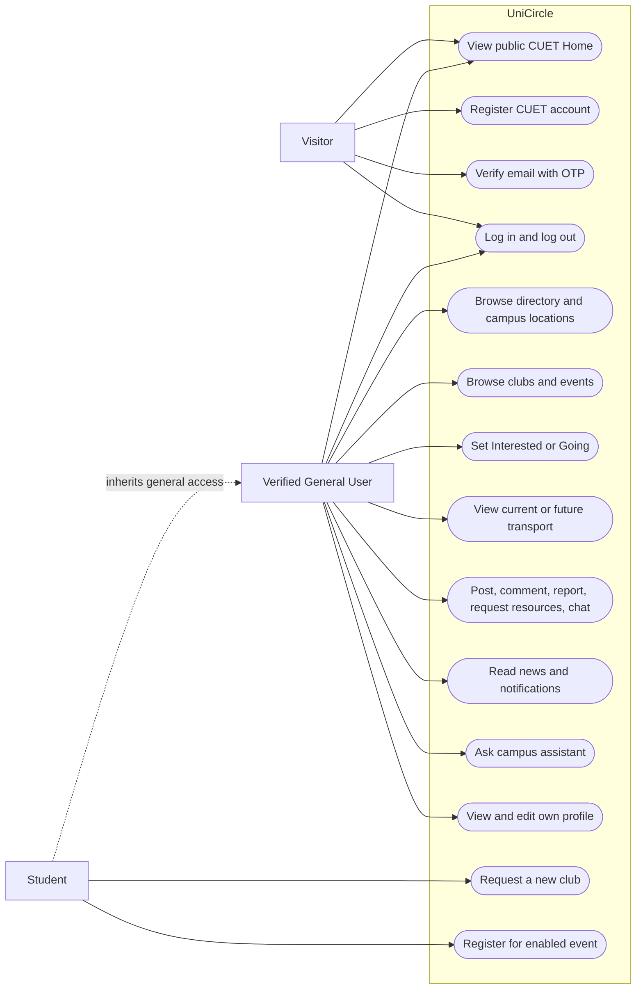
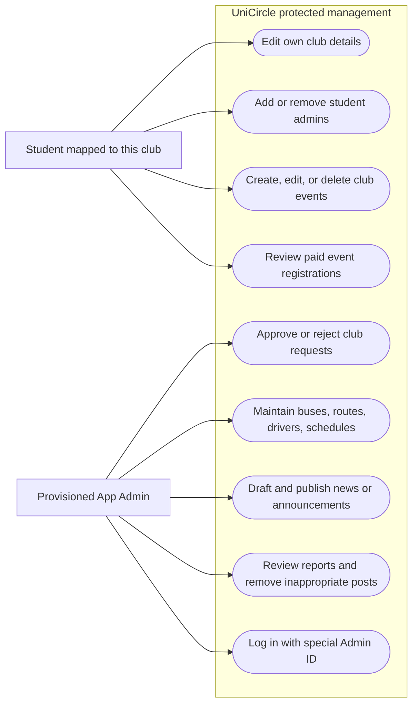
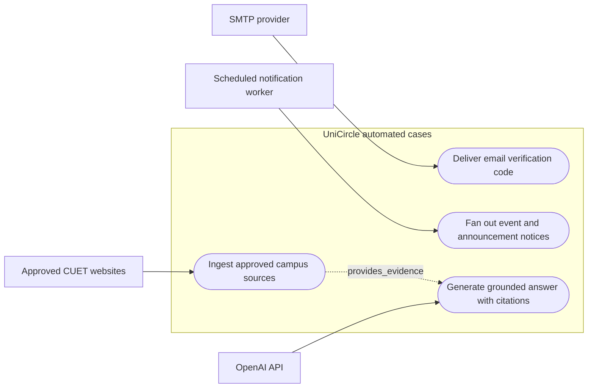

# UniCircle use-case diagrams

Status: **planned behavior and permissions**. These Mermaid actor-to-use-case views use oval nodes for use cases so they render in the repository; they are UML-style rather than an executable permission policy. Server-side authorization rules are specified in the [LLD](LLD.md) and enforced later in FastAPI.

## Visitor and General User cases

`General User` means a verified, active student, teacher, or staff account. `Student` specializes that actor for student-only club requests and event registration. Resource requests and chat are only between authorized participants; acceptance is required before chat. Other feature pages are unavailable to a visitor even though Home remains public.

## Club Admin and App Admin cases

Club Admin is a **per-club student membership**, not a global login role. A student who administers Club A has no write permission for Club B unless separately mapped. App Admin does not automatically become a club admin and does not use public registration. App Admin's central privileges are limited to the areas assigned by the workflow, not every entity in the ERD.

## External collaborators and automated cases

External collaborators do not receive broad application permissions. SMTP receives only a verification message. The scheduled worker acts on durable outbox/schedule state and uses idempotency. Approved CUET sites supply source material; OpenAI receives a bounded question plus retrieved evidence, not account secrets or private data.

## Use-case conditions

| Use case | Required condition | Failure/alternative |
| --- | --- | --- |
| Verify email | Valid, unexpired, unused OTP for a pending CUET account | Invalid/expired/attempt-exhausted code is rejected; resend has cooldown |
| Log in | Correct credentials, verified and active account | Generic credential error; no Admin self-registration |
| Request club | Authenticated student | Pending request remains private until approved |
| Manage club/event | Student mapped to the target club | Other club's mutation denied; final admin cannot be removed |
| Register for event | Authenticated student, event registration enabled and open | One registration per user/event; paid claim requires transaction ID and review |
| Chat | Participant in an accepted resource request | Pending/rejected or unrelated conversation denied |
| Admin review/publish/moderate | Provisioned App Admin with current active session | Normal users and Club Admins denied |
| Ask assistant | Authenticated user, allowed question and quota | No relevant context returns `not-found`; provider failure returns safe error |

Detailed ordering is shown in the [sequence diagrams](Sequence_Diagram.md); records are shown in the [ERD](ERD.md).
